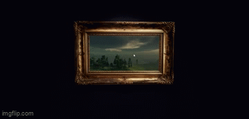

# Galleria

Inspired by this project: https://pmndrs.github.io/examples/enter-portals/ and the feeling of getting lost in an art museum. The goal is to create a webpage where the user can turn left or right and see different art portals as they move.

## What Does it Do?? (Currently)
 
1. Load in by following the preview link
2. Use your scroll wheel to get real close to the stock image painting
3. Use your left mouse button to look around the painting and notice how the perspective changes

## Current Demo Images

<p align="center">
  
</p>

## Current To Do:

- create the admin portal
- fix current bugs:
- images that are too wide/ large don't wrap nicely, so set standard sizing for images (either set for it to manually adjust or make standard sizing for artists to comply with when they post)
- if three.js can't render the mesh model for the art, the page crashes and will need a reload (only happens with links that it can't open, so might not be a concern if artists are uplaoding to a connected bucket)
- set character limits (will need to see what looks good on the frontend once I get to adding descriptions/ art details to the wall)
- A LOT OF TESTING ;cries;

## Tech stack & key dependencies

| Package | Purpose |
|---|---|
| `Vite` | Frontend framework |
| `react` | UI framework |
| `typescript` | Frontend langauge |
| `tailwindcss` | Styling |
| `motion` (`motion/react`) | Moving the cards in a circle |
| `@react-three/fiber` | React renderer for Three.js |
| `@react-three/drei` | Texture loading (`useTexture`) and 3D helper utilities |
| `three` | Underlying 3D engine rendering the mesh for the portal frame, the sphere for the portals, and other misc 3D objects |
| `FastAPI` | Backend framework, handles API routes for art, users, and auth |
| `Python` | Backend language |
| `SQL` | Querying language |
| `SQLAlchemy` | ORM mapping Python models to Postgres tables |
| `PostgreSQL` | Relational database storing art, users, and user types |
| `Pydantic` | Request/response validation and typed schemas for the API |
| `python-jose` + `passlib` | JWT auth and password hashing for artist/admin accounts |
| `Cloudflare` | Frontend Hosting |
| `AWS Lambda` | Backend Hosting |
| `Neon` | Storage |

## Project structure
 
```
Galleria/
├── frontend/
│   ├── public/
│   │   └── models/
│   │       └── ornate-gold-vintage-frame  # Frame asset
│   └── src/
│       ├── App.tsx                        # Handles navbar routing for now
│       ├── lib/
│       │   └── api.ts                     # Wrapper for calls to the FastAPI backend
│       ├── types/
│       │   └── types.ts                   # Datatypes shared with the backend API
│       ├── data/
│       │   └── data.ts                    # Holds temp testing data (hardcoding tests)
│       └── components/
│           ├── webpage/
│           │   ├── Landing.tsx            # Asks if user is a guest or an artist
│           │   └── Gallery.tsx            # If the user is a guest, brings them to the gallery that displays the art portals
│           ├── frame/
│           │   ├── Picture.tsx             # Renders the portal frame and calls the sphere
│           │   └── Sphere.tsx             # Inverted sphere with art overlay (gives the fun perspective)
│           ├── artist/
│           │   ├── Upload.tsx             # Upload their art, description, socials, etc
│           │   └── Manage.tsx             # Manage their uploaded art
│           └── admin/
│               ├── AuthContext.tsx        # Tracks logged-in user/session state
│               ├── Signup.tsx             # Artist/admin account creation
│               └── Login.tsx              # Artist/admin sign-in
│
└── backend/
    ├── main.py                            # App entrypoint, CORS, router registration
    └── app/
        ├── security.py                    # Password hashing for security
        ├── config.py                      # Loads .env into a typed settings object
        ├── database.py                    # SQLAlchemy engine + session setup
        ├── models/
        │   ├── art.py                     # ORM model for art pieces
        │   └── artist.py                  # ORM model for artists
        ├── schemas/
        │   ├── art.py                     # Pydantic request/response shapes for art
        │   └── artist.py                  # Pydantic request/response shapes for artist
        └── routers/
            ├── art.py                     # /art endpoints
            └── artist.py                  # /artist, /auth endpoints
```

### Credits
- "Ornate Gold Vintage Frame" (https://skfb.ly/pK9qr) by journeyk
